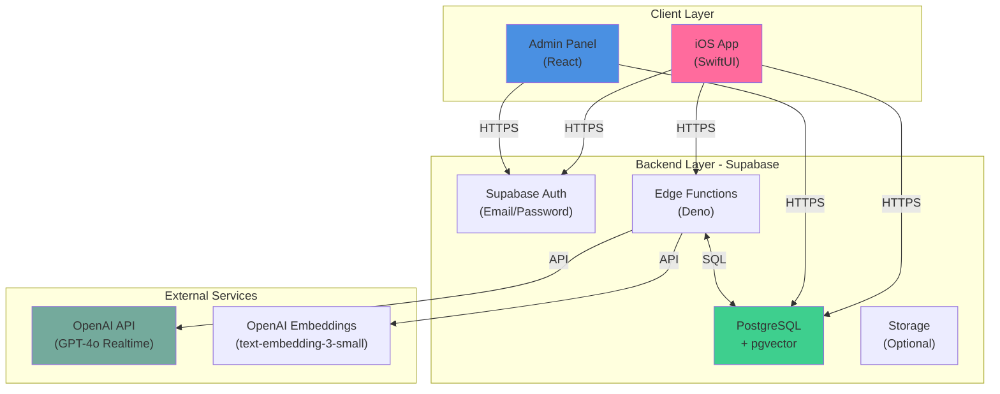
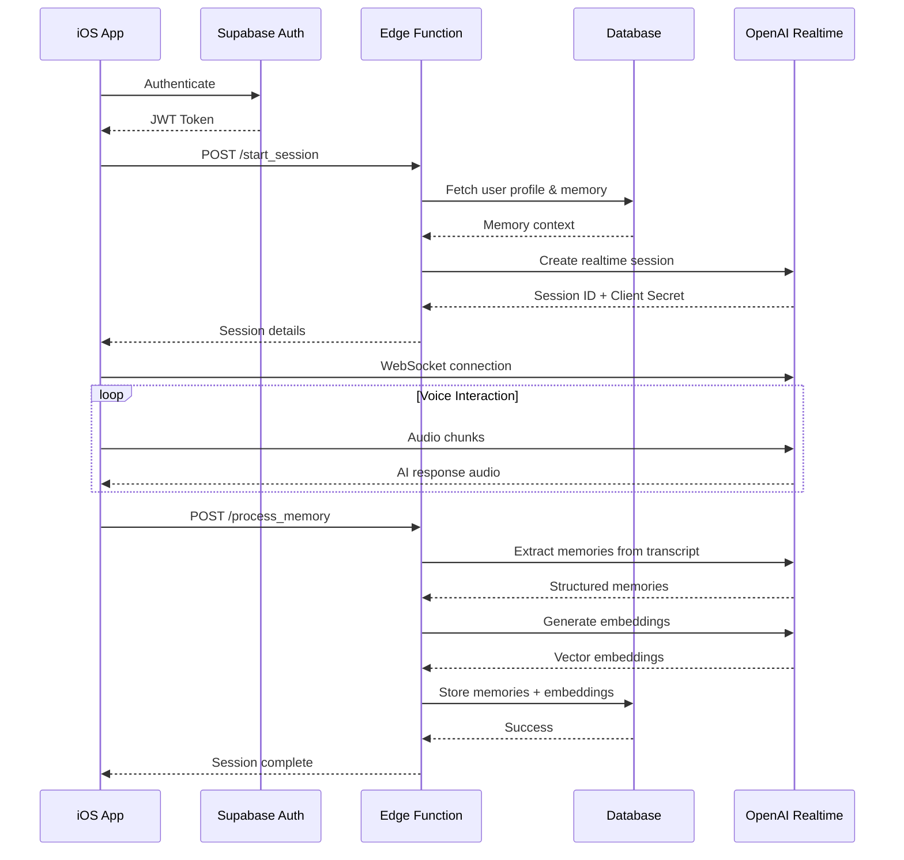
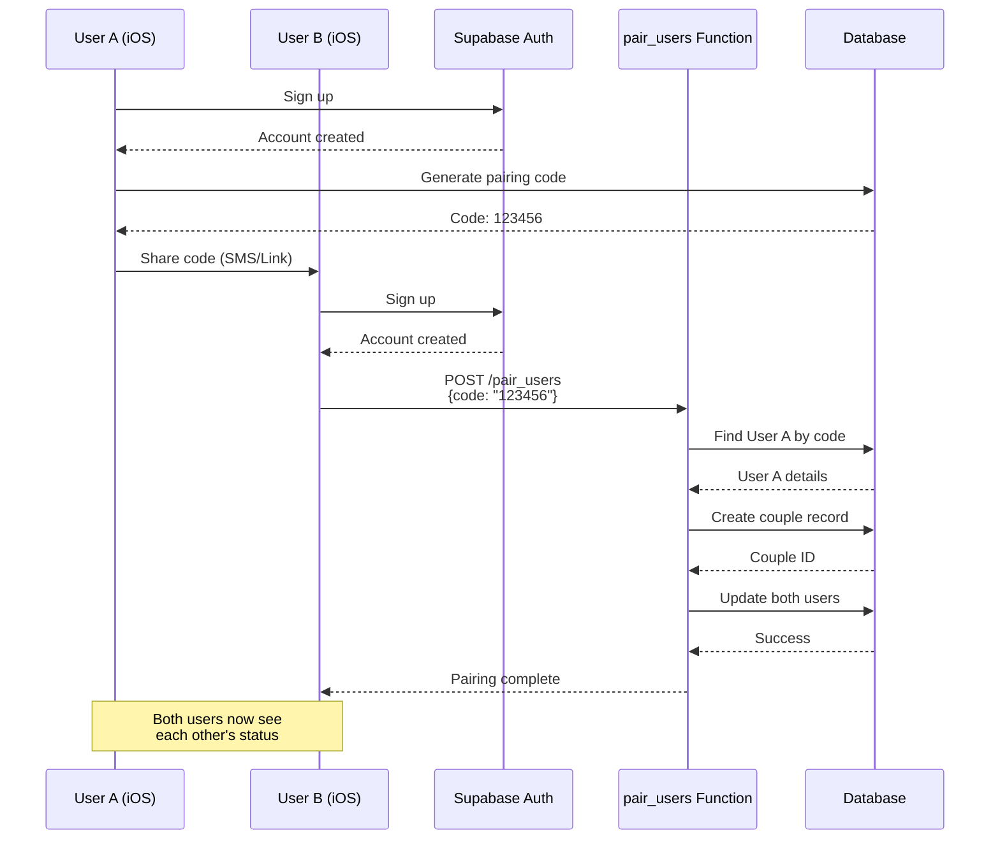
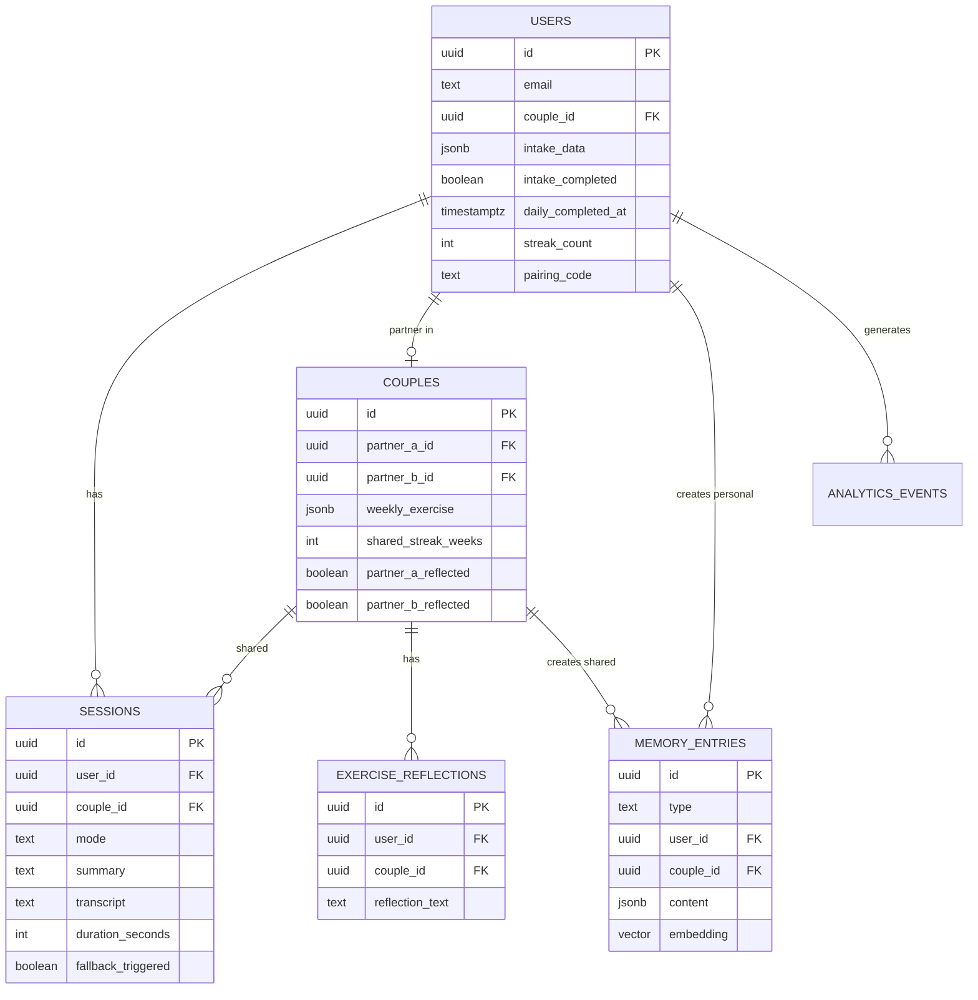
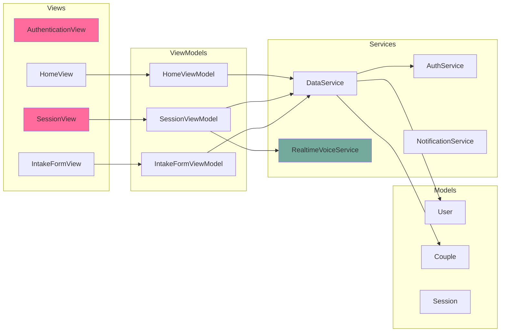
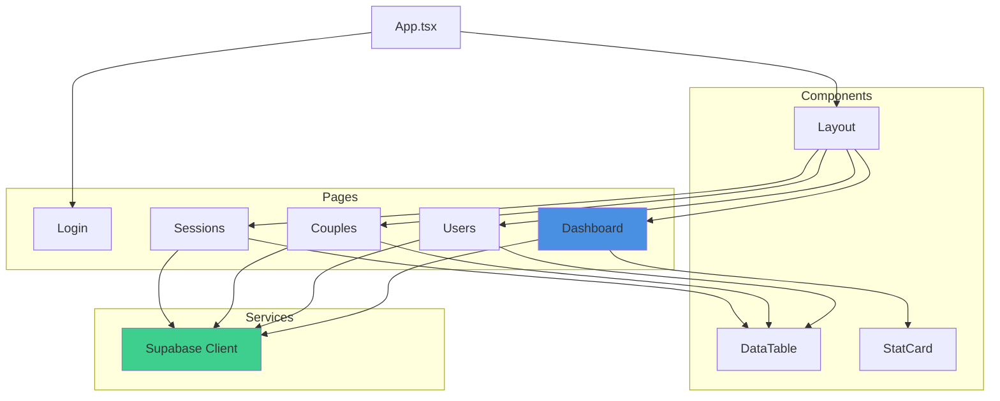
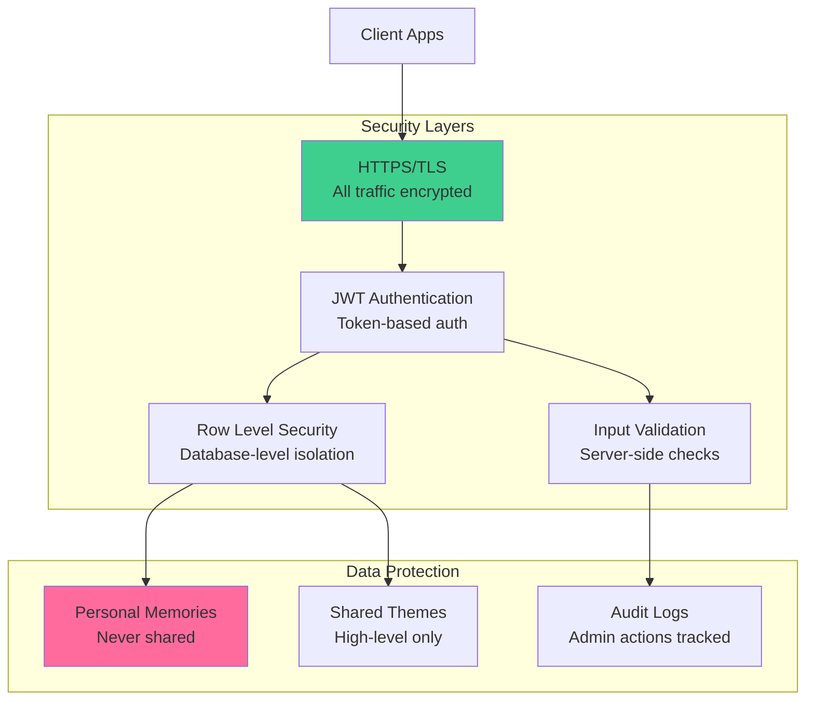
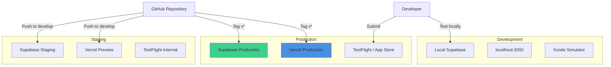
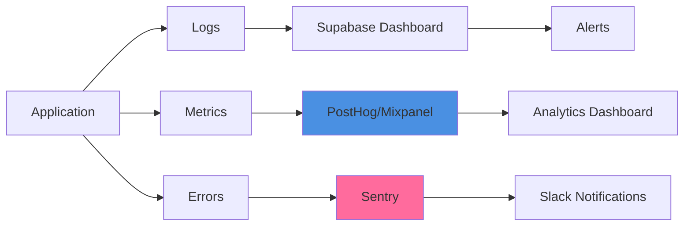

# Amora MVP - Architecture Overview

This document provides a comprehensive view of the system architecture.

## System Architecture

## Data Flow Diagrams

### Daily Session Flow

### Partner Pairing Flow

## Database Schema

## Component Architecture

### iOS App (MVVM)

### Admin Panel

## Technology Stack

### Backend

| Component | Technology | Purpose |
|-----------|-----------|---------|
| Database | PostgreSQL 15+ | Primary data store |
| Auth | Supabase Auth | User authentication |
| Functions | Deno (TypeScript) | Serverless compute |
| Vector DB | pgvector | Semantic memory search |
| Hosting | Supabase Cloud | Managed infrastructure |

### Frontend (Admin)

| Component | Technology | Purpose |
|-----------|-----------|---------|
| Framework | React 18 | UI library |
| Language | TypeScript | Type safety |
| Build Tool | Vite | Fast dev server |
| Styling | Tailwind CSS | Utility-first CSS |
| Routing | React Router v6 | Client-side routing |
| State | React Hooks | State management |

### Mobile (iOS)

| Component | Technology | Purpose |
|-----------|-----------|---------|
| Framework | SwiftUI | Declarative UI |
| Language | Swift 5.9+ | Type-safe language |
| Architecture | MVVM | Clean separation |
| Networking | Supabase-Swift | Backend SDK |
| Audio | AVFoundation | Audio capture/playback |
| State | Observation | Reactive updates |

### AI Services

| Service | Model | Purpose |
|---------|-------|---------|
| Voice AI | gpt-4o-realtime-preview | Real-time conversations |
| Text AI | gpt-4o | Memory extraction |
| Embeddings | text-embedding-3-small | Semantic search (1536d) |

## Security Architecture

## Deployment Architecture

## Performance Considerations

### Database Optimization

- **Indexes**: All foreign keys and frequently queried columns
- **Connection Pooling**: Supabase pooler for serverless functions
- **Query Optimization**: Select specific columns, not `SELECT *`
- **Vector Search**: HNSW index for fast similarity search

### Frontend Optimization

- **Code Splitting**: Lazy load routes and heavy components
- **Pagination**: Limit data fetching to 50 items per page
- **Caching**: React Query or SWR for API caching
- **Bundle Size**: Tree-shaking and minification

### Mobile Optimization

- **Lazy Loading**: Load data on-demand
- **Image Caching**: Cache profile images and assets
- **Background Tasks**: Use background queues for heavy operations
- **Memory Management**: Release unused resources

### Cost Management

| Service | Free Tier | Estimated Cost (100 couples) |
|---------|-----------|------------------------------|
| Supabase | 500MB DB, 2GB bandwidth | Free tier sufficient |
| OpenAI Realtime | $0.06/min audio | ~$150-200/month |
| Vercel | 100GB bandwidth | Free tier sufficient |
| Total | - | ~$160-210/month |

## Scaling Considerations

### Immediate (100-500 couples)
- Current architecture sufficient
- No changes needed
- Monitor Supabase metrics

### Medium (500-2,000 couples)
- Add caching layer (Redis)
- Optimize database queries
- Consider read replicas
- Implement rate limiting

### Large (2,000+ couples)
- Dedicated database instance
- CDN for static assets
- Background job queue
- Horizontal scaling of functions

## Monitoring & Observability

## Key Metrics to Track

1. **User Engagement**
   - Daily Active Users (DAU)
   - Session completion rate
   - Average session duration
   - Streak maintenance rate

2. **Technical Health**
   - API response times
   - Error rates by endpoint
   - Database query performance
   - OpenAI API latency

3. **Business Metrics**
   - Pairing success rate
   - Weekly exercise completion
   - User retention (D7, D30)
   - Churn rate

## Disaster Recovery

### Backup Strategy
- **Database**: Automated daily backups (Supabase)
- **Code**: Version controlled in Git
- **Secrets**: Stored in password manager
- **Recovery Time Objective (RTO)**: 4 hours
- **Recovery Point Objective (RPO)**: 24 hours

### Incident Response
1. Detect issue (monitoring alerts)
2. Assess impact and severity
3. Communicate to users if needed
4. Execute recovery plan
5. Post-mortem analysis

---

For more details on specific components, see:
- Backend: `backend/README.md`
- Admin: `admin-web/README.md`
- iOS: `ios/README.md`
